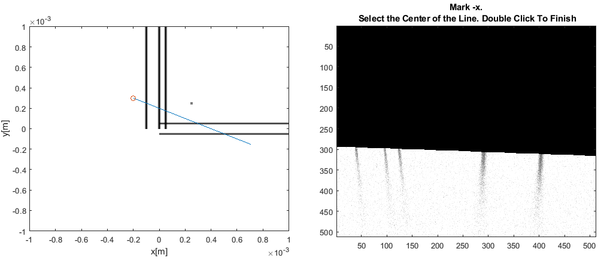

# HashtagAlignment
Contains alignment algorithm MATLAB code in folder **/Code**  
Contains Odin microscope  tiling code in folder **/Odin**  
Contains photobleaching code for Wasatch OCT in folder **/Wasatch**  

## To run Hashtag-Alignment Simulation:
Enter folder **/Code** and run file `simulationv3.m`

